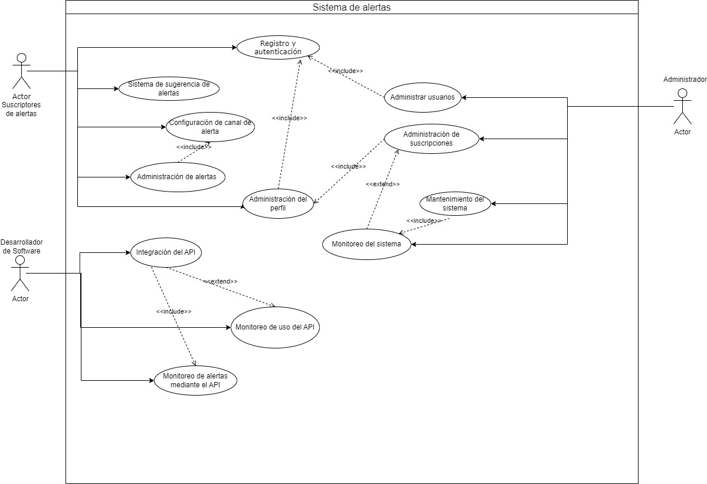

## Sistema de Alertas Multi-Canal ##
## Descripción del Proyecto ##
El Sistema de Alertas Multi-Canal es una plataforma web que permite a los usuarios configurar y recibir alertas personalizadas a través de múltiples canales, incluyendo WhatsApp, correo electrónico y llamadas telefónicas. El sistema está diseñado para ser flexible, escalable y seguro, proporcionando una solución eficiente para la gestión de notificaciones y recordatorios.

## Características Principales: ##
* Autenticación Segura: Acceso al sistema mediante autenticación por correo electrónico.
* Configuración de Alertas Personalizadas: Los usuarios pueden crear alertas especificando la hora, fecha y canal de notificación.
* Notificaciones Multi-Canal: Soporte para notificaciones a través de WhatsApp, correo electrónico y llamadas telefónicas.
* Sugerencias Inteligentes: Algoritmo de aprendizaje automático para sugerir alertas basadas en patrones de uso.
* Gestión de Precios: Configuración y actualización de precios según la cantidad de alertas generadas.

## Diagramas ##
* Casos de uso

## Requerimientos para ejecutar el código ##
*  Instalar Git
*  Contar con node JS version 20 en adelente, preferentemente 20.11.0
*  Instalar las librerias dentro de node modules mediante el uso de npm o yarn
*  Configurar las variables de entorno .env con tus propios clientes de prueba de Google Identity
  ~~~Python
  REACT_APP_CLIENTE_ID = <Id del cliente>
  ~~~
